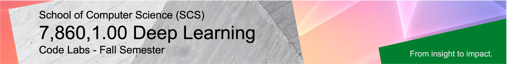

Welcome Fall Semester 2025 students to our course **Deep Learning**, taught by **Prof. Dr. Damian Borth**.

Lectures and hands-on lab courses alternate to provide a better learning experience in this course. The materials for Deep Learning labs are available and accessible through this repository.

The the lab content is based on [Python](https://www.python.org), [Jupyter Notebook](https://jupyter.org) and [PyTorch](https://pytorch.org). This repository is supported by the course TAs [Konstantinos Tzevelekakis](https://www.alexandria.unisg.ch/entities/person/Konstantinos_Ioannis_Tzevelekakis) and [Aron Asefaw](https://ics.unisg.ch/the-institute/about-us/team/detail/person-id/51e76fca-37cd-4d91-a230-12a6540ec575/). Lab notebooks are developed by [Hamed Hemati](https://www.alexandria.unisg.ch/persons/8884).

Happy Coding!

## Course Logistics

- **Lectures:** Wednesdays 2:15-3:45PM CET
- **Labs:** Wednesdays 4:15-5:45PM CET

- **Announcements:** All course-related announcements and questions will happen on Canvas.

## Course Code Lab Notebooks 

This table lists all lab session and coding challenge session incl. the launchers of the corresponding notebooks. In order to start the notebooks in the respective cloud environment just click on the to corresponding launchers.

| Date                    | Lab        |  Content                         |  CoLab                 | 
|:-----------------------:|:--------------:|:---------------------------------|:-------------------------------:|
| 08.10.2025            | **Lab 1**   | Meta Learning          | 
| 15.10.2025            | **Lab 2**   | Continual Learning     | 
| TBA            | **Lab 3**   | Hyper Networks | 

## How To Run the Course Code Lab Notebooks

#### Option 1: Google Colab Environment

Similar to binder, you just have to click the Colab badge next to the Notebooks below. All you need is a Google login
(e.g., your login information for gmail) and you can use this service at no charge.
Two advantages of Colab are that (1) you can save your
Notebooks directly into your Google Drive and read data from there, and (2) Google provides you with some limited GPU capabilities
free of charge (this will be an interesting feature for the coding challenge.)

#### Option 2: Local Python Installation

If you prefer to run Notebooks locally on your computer, you will need to install Python. If you choose to do so,
we recommend to install [Anaconda Python](https://www.anaconda.com/products/individual), a package that combines the
latest version of Python with the most common supplemental modules for data science and machine learning, as well
as a Jupyter Notebook server that runs on your computer locally. Anaconda
[installers](https://www.anaconda.com/products/individual#Downloads) are available
for the most common operating systems, as well as some
[detailed installation guides](https://docs.anaconda.com/anaconda/install/).

If you need help running Python and/or Jupyter Notebooks, please don't hesitate to contact us (see below)!

## Questions?

- For course related questions use [Canvas](https://learning.unisg.ch/courses/24693). For external enquiries, emergencies, or personal matters that you don't wish to put in a forum post, you can email us via: [aiml-teaching.ics@unisg.ch](mailto:aiml-teaching.ics@unisg.ch?subject=DL2025%20|%20place%20your%20subject%20here"). Please make sure that the subject of your email is appropriately prefixed with the course's name `DL2025`.
